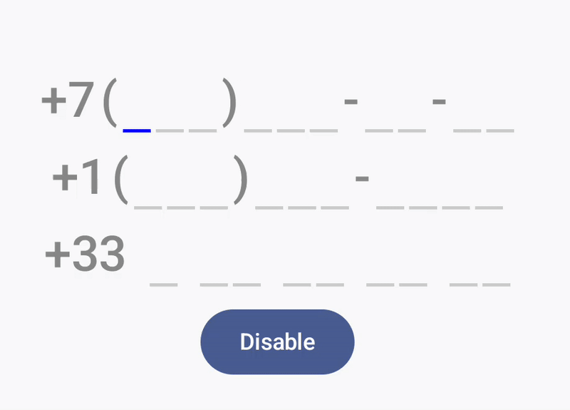
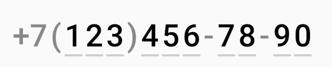

# Compose Phone OTP Text Field

[](https://example.com) This library provides a customizable `PhoneOtpTextField` Composable for Android, designed for entering phone numbers with a predefined format (mask).  It supports features like:

*   **Customizable Masking:** Define the phone number format using a sequence of `PhoneNumberElement`s (either `Mask` for static characters or `EditableDigit` for digit placeholders).
*   **Digit-Only Input:**  Restricts input to numeric characters only.
*   **Length Limit:**  Automatically enforces the maximum number of digits based on the provided mask.
*   **Cursor Position Tracking:**  Provides a callback to get the current *visual* cursor position within the formatted text (including mask characters).
*   **Composable UI:** Built with Jetpack Compose for easy integration into your Compose-based UI.
*   **Customizable Appearance:**  Allows customization of text style and colors for both mask and editable digit elements.

## Demo



## Usage

1.  **Define the Phone Number Format:**

    Create a `List<PhoneNumberElement>` to represent your desired phone number format.  Use `PhoneNumberElement.Mask` for static characters (like parentheses, spaces, dashes) and `PhoneNumberElement.EditableDigit` for each digit the user can enter.

    ```kotlin
    // Example: Russian phone number format
    val russianPhoneNumberFormat: List<PhoneNumberElement> = listOf(
        PhoneNumberElement.Mask("+7"),
        PhoneNumberElement.Mask("("),
        PhoneNumberElement.EditableDigit,
        PhoneNumberElement.EditableDigit,
        PhoneNumberElement.EditableDigit,
        PhoneNumberElement.Mask(")"),
        PhoneNumberElement.EditableDigit,
        PhoneNumberElement.EditableDigit,
        PhoneNumberElement.EditableDigit,
        PhoneNumberElement.Mask("-"),
        PhoneNumberElement.EditableDigit,
        PhoneNumberElement.EditableDigit,
        PhoneNumberElement.Mask("-"),
        PhoneNumberElement.EditableDigit,
        PhoneNumberElement.EditableDigit,
    )
    ```

2.  **Use the `PhoneOtpTextField` Composable:**

    ```kotlin
    PhoneOtpTextField(
        mask = russianPhoneNumberFormat, 
        value = phoneNumber,
        onValueChange = { phoneNumber = it },
        modifier = Modifier.fillMaxWidth()
    )
    ```
    **Result:**

    
